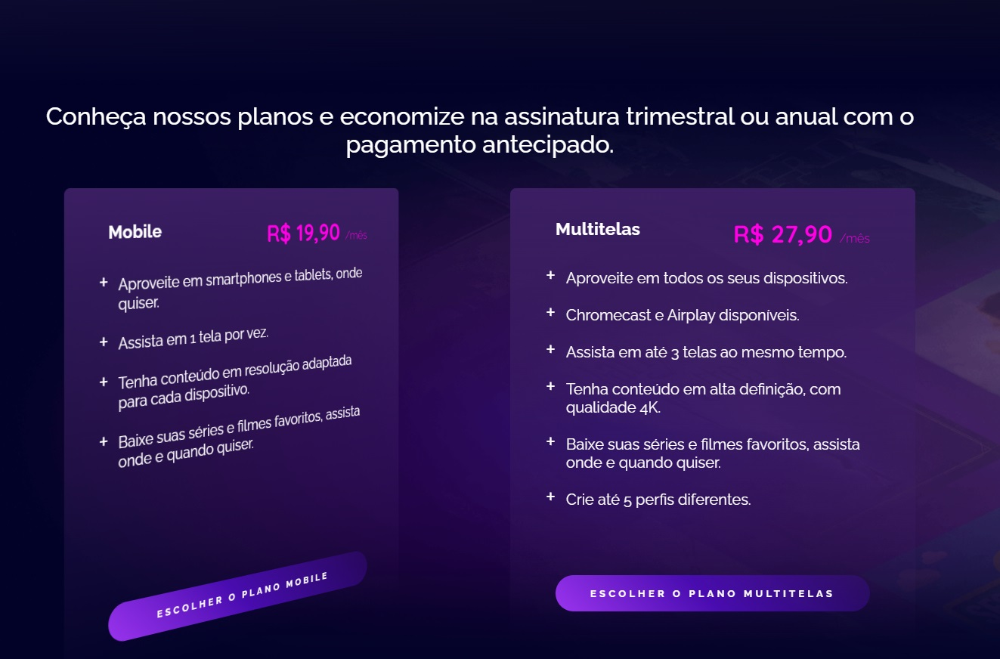
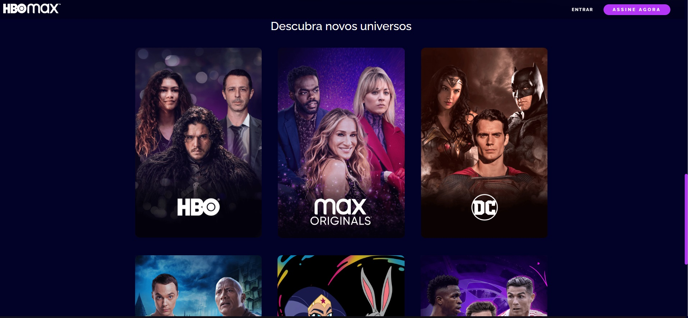

# 📌Clone HBO Max

O projeto é um clone do site HBO Max, com o intuito de reproduzir a interface, com algumas modificações, aplicando os temas abordados ao longo das aulas de CSS da plataforma da Digital Innovation One.

O clone do site HBO Max serve como desafio para os alunos da plataforma testarem seus conhecimentos e colocarem em prática os recursos de HTML e CSS abordados nos cursos.

 

 

 

 

## 📎 **Sumário**
- ⭐ Features
- 📂 Temas abordados
- 🏆 Desafio
- 💻 Demonstração
- 🙋🏻‍♂️ Autor

 

## ⭐ **Features**

- Menu de navegação
- Cabeçalho com animação gradiente
- Cards com os planos de assinatura animados
- Lista de filmes e séries disponíveis na plataforma
- Formulário de login
- Rodapé com links importantes
- UI Responsiva

*As features são visuais, não possuindo integração com nenhuma API. O intuito do projeto é reproduzir a interface do site original, com algumas modificações.*

 

## 📂 Temas abordados

Recursos CSS presentes no projeto:

- Fundamentos do CSS
- Grid Layout
- Flexbox
- Responsividade
- Pseudo-elementos
- Pseudo-classes
- Transformações 2D e 3D
- Transições e animações
- Tratamento de campos inválidos no formulário

 

## 🏆 Desafio
Aplicar os conceitos aprendidos em CSS, utilizando animações, transições, design responsivo, efeitos de interações dos elementos com o usuário, validação de form com css e utilização tanto de grid layout como flexbox.

 

## 💻 Demonstração
Você pode acessar ao resultado final do projeto <a href="https://hbo-max-clone.netlify.app/">Clicando aqui</a>.

 

## 🙋🏻‍♂️ Autor

Bruno Oliveira
